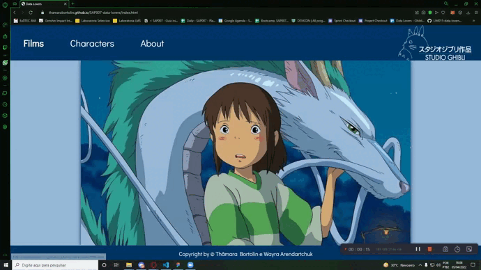

# Ghibli`s Tour

  

  Confira a aplicação clicando [aqui.](https://thamarabortolin.github.io/SAAP-Ghibli-s-Tour/)

## Índice

- [1. O que é o projeto?](#1-o-que-é-o-projeto-?)
- [2. Versões do Projeto](#2-versões-do-projeto)
- [3. História de usuário e Proto Personas](#3-histórias-de-usuários-e-proto-personas)
- [4. Protótipos da página](#4-protótipos-da-página)
- [5. Produto](#5-produto)
- [6. Desenvolvedoras](#6-desenvolvedoras)

---

## 1. O que é o projeto?
___

Projeto refatorado pelo Squad 4, durante uma semana, para apresentação na Demo Day. Esse projeto tinha como objetivo aplicar as ideias de user-centricity, portanto o foco era realizar entrevistas com usuários e definir um produto que resolvesse as dores de nossas proto-personas.

Ghibli`s Tour é uma proposta que transforma dados em informações interativas e acessíveis, dando a possibilidade aos fãs ou curiosos fazerem um tour completo na galeria de filmes do Studio Ghibli por meio da aplicação web. Os usuários podem conferir os filmes, os personagens e suas características por meio dos filtros existentes na aplicação.

Aproveite esta viagem pelo Studio Ghibli!

## 2. Versões do Projeto
___

Este é o projeto na versão anterior. Nessa versão o foco era em ordenação e uma filtragem por nome, sua cor era azul. Haviam muitas animações nos cards que atingiam nosso público jovem de maneira positiva.

 

Este é o projeto na versão pós refatoramento. Como queríamos alcançar um público maior, com melhor legibilidade no site, pensando em transformar nosso app web em um site com referências, decidimos ir para uma nova atualização nos levando em direção à nova versão. Algumas animações de flip não permitiam que o usuário copiasse as informações de trás dos cartões.

 

## 3. Histórias de usuários e Proto Personas
___

Foram realizadas pesquisas com o público-alvo da nossa aplicação. Com base nas informações extraídas, definimos as histórias de usuários.

Confira a pesquisa completa com os usuários [aqui.](https://docs.google.com/document/d/12XHd6yv1xkvEV3jsMAj8usUVEU4wvXIl2sFB0yXhvOw/edit#)

 

## 4. Protótipos da página
___

O Protótipo foi criado pela ferramenta [FIGMA](https://www.figma.com/embed?embed_host=share&url=https%3A%2F%2Fwww.figma.com%2Ffile%2FzzATXKUw2b0kKQlpuSpDWh%2FGhibli's-Tour)

**Prótotipo de baixa fidelidade:**

**Protótipo de alta fidelidade:**

Página Inicial

Página de Filmes

 

## 5. Produto
___

### Logo

### Business Model Canvas

## 6. Desenvolvedoras
___

Este projeto foi desenvolvido por:
 

  |  [Bruna de Paula](https://github.com/Brulibra)  |  [Elizenai Silva](https://github.com/elizenai)  |  [Gabriela Medrado](https://github.com/GabrielaMedrado)  |
  |----------|----------|----------|
  |  |   |  |

  |  [Mônica Guimarães](https://github.com/MonicaGuimaraes)  |  [Suelen Escorcio](https://github.com/suelenescorcio)  |  [Thamara Bortolin](https://github.com/ThamaraBortolin)  |
  |----------|----------|----------|
  |  |   |  |

##

___

  Ainda não conferiu a aplicação? Escaneie o código ou clica na imagem!

  

